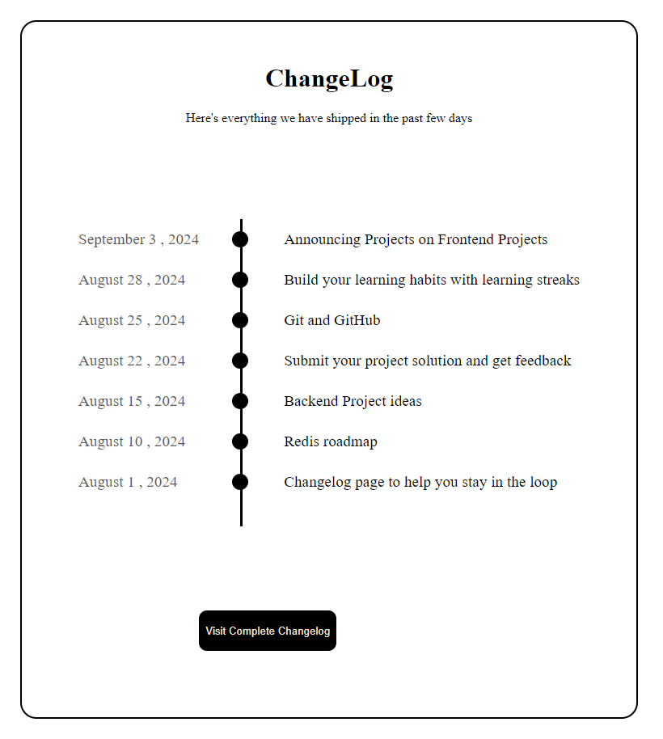

# Changelog

A responsive and customizable changelog component built using HTML and CSS.

## Features

* Responsive design for mobile and desktop devices
* Clean and simple layout
* Easy to customize with HTML and CSS
* Supports multiple version formats (semantic versioning)
* Links to GitHub releases and issues

_Browser Support_

- Google Chrome
- Mozilla Firefox
- Microsoft Edge

- *Changelog Format*

- Use semantic versioning (e.g., v1.0.0)
- Include brief descriptions for each version
- Use unordered lists for changes
- Link to GitHub releases and issues

_Version History_

- v1.0.0 - Initial release
- v1.1.0 - Bug fixes and feature additions

